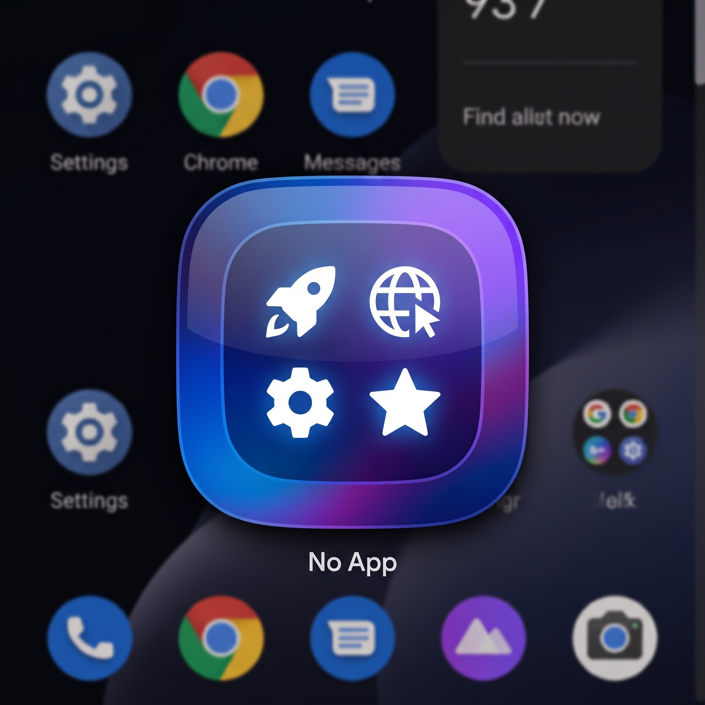

# Not App

A flexible Android launcher app that turns your home screen icon into a customizable command center.



## What is Not App?

Instead of cluttering your home screen with dozens of app shortcuts, **Not App** gives you one icon that does many things. Configure it once, tap it endlessly.

## How It Works

Choose your interaction style:

### LIST Mode (Default)
Tapping the app icon brings up your full shortcut list in a sleek bottom sheet. Long tap for direct OS shortcuts to individual items.

### DIRECT Mode
Tapping the app icon launches your primary shortcut instantly, no UI, no delay. Long tap for shortcuts to your backups and alternatives, managed by the OS.

### MIX Mode
Tapping the app icon launches your primary shortcut instantly, same as DIRECT — but your full shortcut list also opens on top of it, so the rest of your items are always one tap away. Long tap still works too, managed by the OS.

## Features

- **Unlimited shortcuts**: App launches, URLs, custom intents — configure as many as you need
- **Three interaction modes**: LIST for exploration, DIRECT for speed, MIX for both at once
- **Drag-to-reorder**: Arrange your shortcuts exactly how you want them
- **Customizable icons**: Emoji badges, colored labels, or the original app icons
- **Smart sharing**: Share text directly to your shortcuts — use `{{word}}` placeholders in URLs to dynamically insert shared content
- **Import/export**: Backup and restore your entire config as JSON
- **OS integration**: Syncs with Android App Shortcuts for long-press menu support

## Build

```
./gradlew assembleDebug
```

Requires Android SDK platform 36 + build-tools 36.1.0 (`local.properties` with `sdk.dir=...`, gitignored).

## License

MIT (see `LICENSE`).
